








My name is Wei Dai (戴威), I'm a 3th-year undergraduate student at the School of Communication Engineering, Xi'an University of Electronic Science and Technology, supervised by [Licheng Jiao](https://faculty.xidian.edu.cn/JLC/zh_CN/index.htm) [Google Scholar](https://scholar.google.com/citations?user=FZbrL2YAAAAJ&hl=en)、[Xinbo Gao](https://web.xidian.edu.cn/xbgao/) [Google Scholar](https://scholar.google.com/citations?hl=zh-CN&user=VZVTOOIAAAAJ)、[Xi Yang](https://web.xidian.edu.cn/yangx/) [Google Scholar](https://scholar.google.com/citations?hl=zh-CN&user=W5c-LSYAAAAJ). I also worked with PhD student at Luojiashan Laboratory, Wuhan University [Wenke Huang](https://wenkehuang.github.io/), PhD student at the School of Artificial Intelligence, Xi'an University of Electronic Science and Technology [Yanbiao Ma](https://scholar.google.com/citations?hl=zh-CN&user=j05wwXcAAAAJ).  

<!-- 🎈 <a href="https://weidai-david-chinese.github.io/"><strong>中文版学术主页</strong></a> -->

🌟 I am actively applying for a PhD in the fall of 2026 , and applying for a direct PhD at a university summer camp in 2025! 

🌟 I'm currently actively seeking for Ph.D., Research Assistant, or internship positions related to deep Learning. I'm also open to any possible discussions or collaborate opportunities. If you're interested in working with me, don't hesitate to drop me an email!

<!-- My curriculum vitae (**CV**) can be downloaded [here](https://github.com/GuanchengWan/guanchengWan.github.io/raw/master/docs/GuanchengWan_cv.pdf).  -->

# 🔎 Research 
"The laws of the physical world serve as the fundamental driving force behind the advancement of artificial intelligence" 

I am passionate about using <u>physical Laws</u> to explain principle in the world. Currently, my research interests mainly focus on the following aspects:

a) Unfairness & Prejudice

b) Trustworthy Machine Learning

c) Science for ai
-  Neuroscience
-  Cognitive Science
-  Physics

 

# 🔥 News

<ul>
  <li><em>2025.2:</em> ✨✨✨ I serve as a reviewer for 《IEEE Access》</li>
  <li><em>2025.2:</em> 🚀🚀🚀 One paper is accepted by ICLR. See you in Singapore.</li>
  <li><em>2025.1:</em> 🚀🚀🚀 One paper is accepted by journal《Entropy》</li>
  <li><em>2024.12:</em> ✨✨✨ I serve as a reviewer for CVPR 2025.</li>
  <li><em>2024.12:</em> 🚀🚀🚀 One paper is accepted by journal《Expert Systems》 </li>
  <li><em>2024.10:</em> 🎈 I was honored with a scholarship from Xi'an University of Electronic Science and Technology.</li>
</ul>

 

# 📃 Publications

**&dagger; Equal Contribution**   

<dl>
  <dt>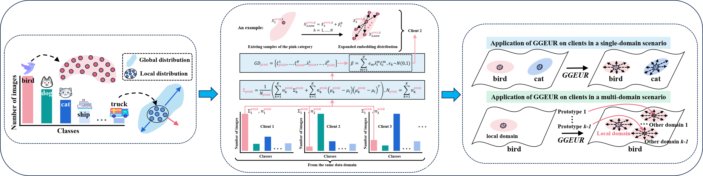
</dt>
  <dd><strong>Geometric Knowledge-Guided Localized Global Distribution Alignment for Federated Learning</strong></dd>
<!-- <dd>Yanbiao Ma&dagger;, <strong><u>Wei Dai&dagger; </u></strong>(co-first), Wenke Huang, Jiayi Chen</dd> -->
<dd><strong><u>Wei Dai&dagger; </u></strong>, Yanbiao Ma&dagger;, Wenke Huang, Jiayi Chen</dd>
<dd> Conference on Computer Vision and Pattern Recognition (<strong>CCF-A CVPR</strong>), 2025 </dd>
</dl>

<dl>
  <dt>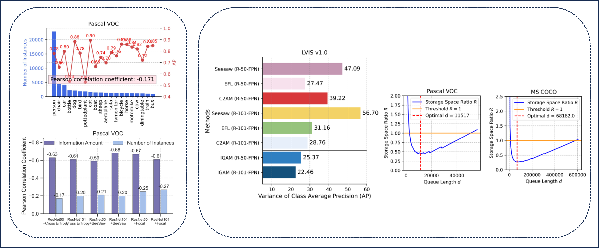
</dt>
  <dd><strong>Pursuing Better Decision Boundaries for Long-Tailed Object Detection via Category Information Amount</strong></dd>
<dd>Yanbiao Ma, <strong><u>Wei Dai</u></strong>, Jiayi Chen</dd>
<dd> International Conference on Learning Representations (<strong>Tsinghua-A ICLR</strong>), 2025</dd>
</dl>

<dl>
  <dt>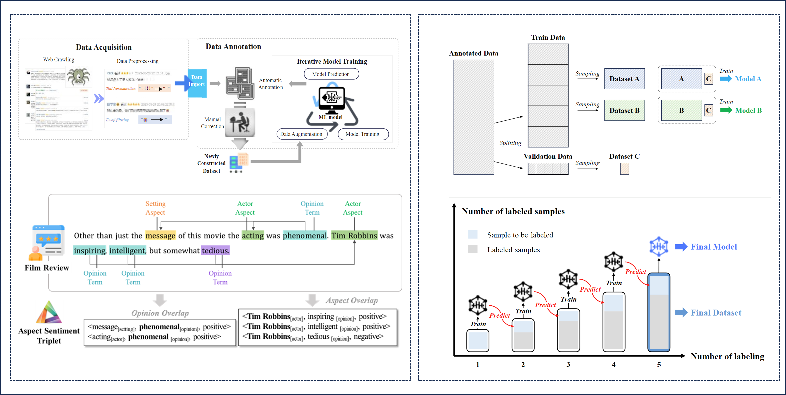
</dt>
  <dd><strong>Guideline for Novel Fine‐Grained Sentiment Annotation and Data Curation: A Case Study</strong></dd>
<dd><strong><u>Wei Dai</u></strong>, Wanqiu Kong, Tao Shang, Jianhong Feng, Jiaji Wu, Tan Qu</dd>
<dd> CCF-C JCR-Q1 IF-3 <strong>  journal 《Expert System》 </strong>, 2025</dd>
</dl>

<dl>
  <dt>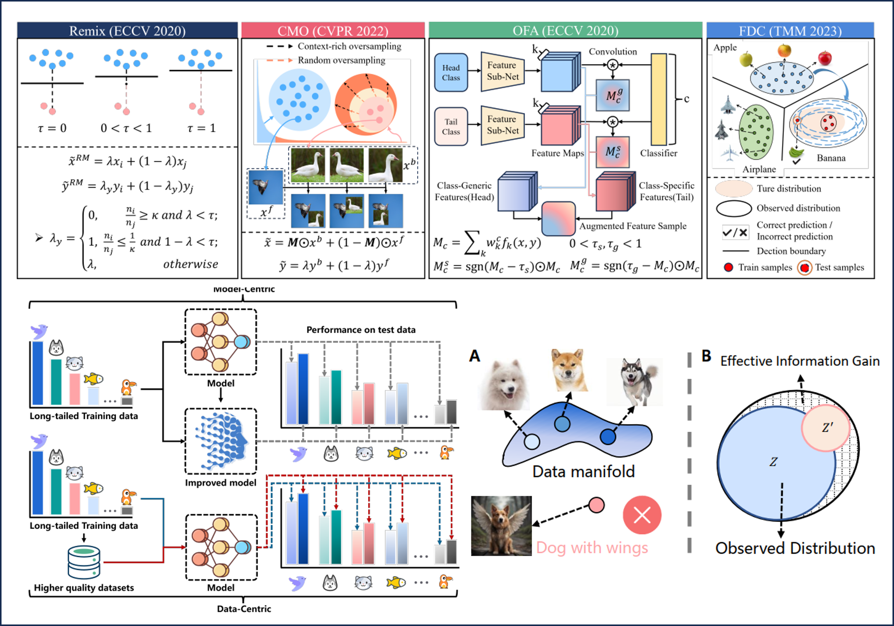
</dt>
  <dd><strong>Trade-Offs Between Richness and Bias of Augmented Data in Long-Tailed Recognition</strong></dd>
<dd><strong><u>Wei Dai</u></strong>, Yanbiao Ma, Jiayi Chen, Xiaohua Chen, Shuo Li</dd>
<dd> CAS-Q3 JCR-Q2 IF-2.2 <strong>  journal 《Entropy》 </strong>, 2025</dd>
</dl>

<dl>
  <dt>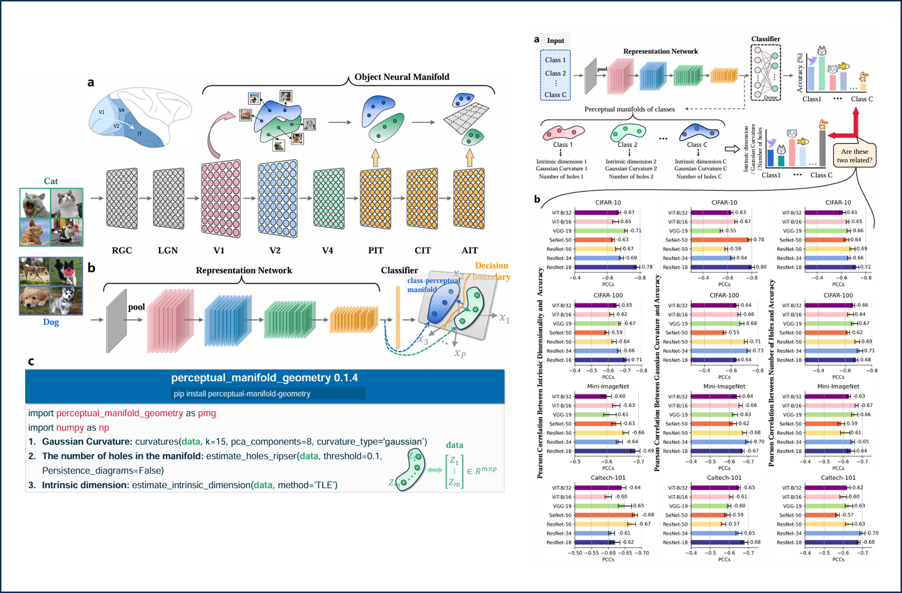
</dt>
  <dd><strong>Revealing Bias Formation in Deep Neural Networks Through the
 Geometric Mechanisms of Human Visual Decoupling</strong></dd>
<dd>Yanbiao Ma, Bowei Liu, <strong><u>Wei Dai</u></strong>, Jiayi Chen, Shuo Li</dd>
<dd> Under review, 2025</dd>
</dl>

<dl>
  <dt>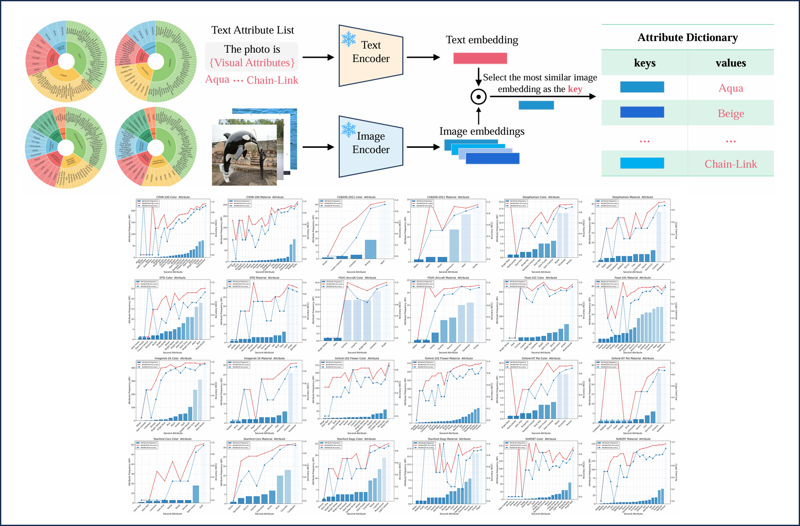
</dt>
  <dd><strong>Compositional Attribute Imbalance in Vision Datasets</strong></dd>
<dd>Yanbiao Ma, <strong><u>Wei Dai</u></strong>, Jiayi Chen, Shuo Li</dd>
<dd> Under review, 2025</dd>
</dl>

<dl>
  <dt>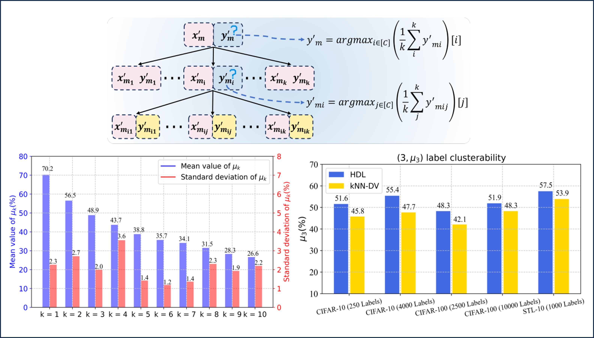
</dt>
  <dd><strong>Exploring Beyond Logits: Hierarchical Dynamic Labeling Based on Embeddings for Semi-Supervised Classification</strong></dd>
<dd>Jiayi Chen, Yanbiao Ma, <strong><u>Wei Dai</u></strong></dd>
<dd> Under review, 2025</dd>
</dl>

# 📝 National invention patent

<dl>
  <dt>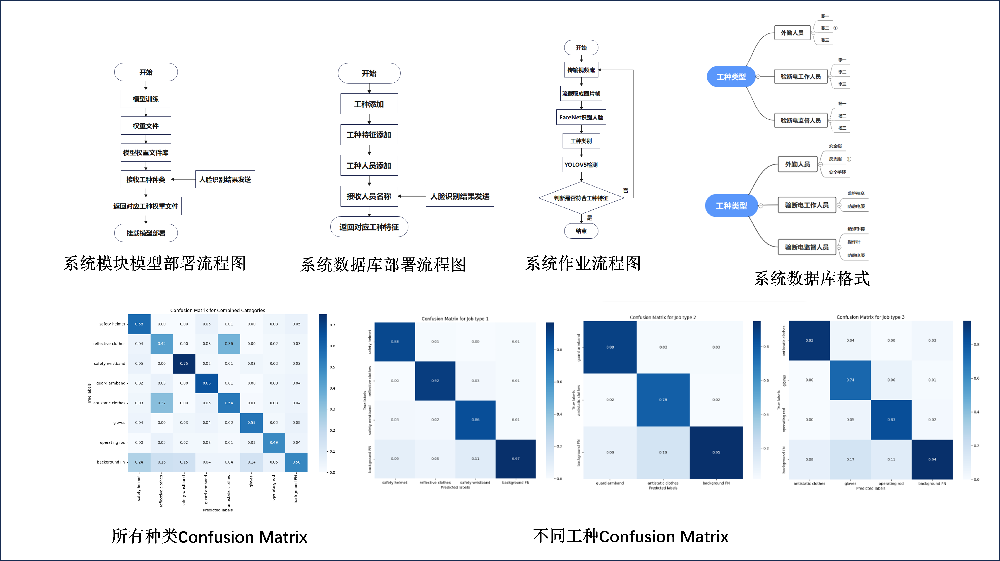
</dt>
  <dd><a href="https://www.xjishu.com/zhuanli/55/202410893258.html"><strong>Multi feature, modular artificial intelligence recognition method and system based on deep learning</strong></a>
  <a href="https://xueshu.baidu.com/usercenter/paper/show?paperid=182y08t0251u0pu07k420t20en690534"><strong>[Baidu Scholar]</strong></a>
  <a href="https://github.com/WeiDai-David/Security-feature-detection-system"><strong>[Github]</strong></a></dd>
<dd><strong><u>Wei Dai</u></strong>, Jiayi Chen, Fengliang Mi</dd>
<dd>Under acceptance, 2024</dd>
</dl>

<dl>
  <dt>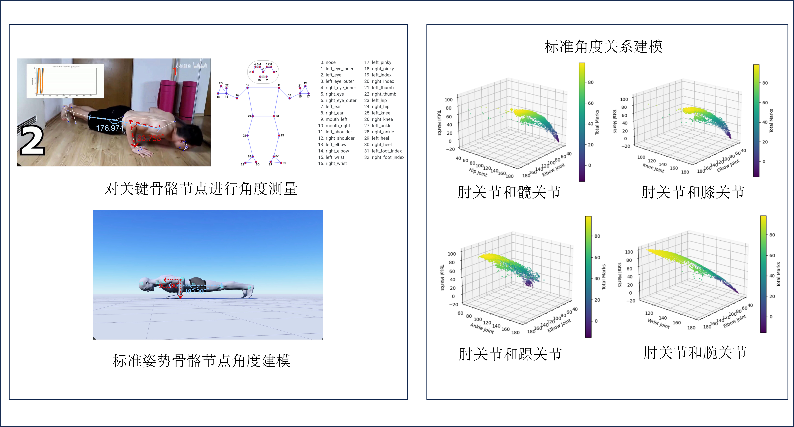
</dt>
  <dd><a href="https://www.xjishu.com/zhuanli/55/202410893256.html"><strong>Multidimensional scoring system and method based on entropy weight method and statistical bias principle</strong></a>
  <a href="https://xueshu.baidu.com/usercenter/paper/show?paperid=1f190pa0cg3p08u06a6d0t00xv253723&site=xueshu_se"><strong>[Baidu Scholar]</strong></a></dd>
<dd>Jiayi Chen, <strong><u>Wei Dai</u></strong>, Fengliang Mi</dd>
<dd>Under acceptance, 2024</dd>
</dl>

<dl>
  <dt>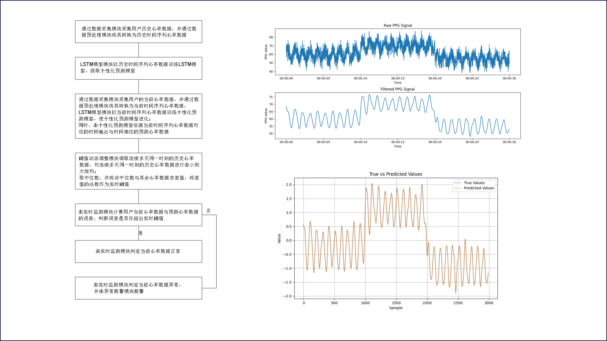
</dt>
  <dd><a href="https://xueshu.baidu.com/usercenter/paper/show?paperid=1n7y0xq0nf4k0eh0m754024005382777&site=xueshu_se"><strong>A personalized heart rate anomaly monitoring method based on LSTM</strong></a>
  <a href="https://xueshu.baidu.com/usercenter/paper/show?paperid=1n7y0xq0nf4k0eh0m754024005382777&site=xueshu_se"><strong>[Baidu Scholar]</strong></a></dd>
<dd>Qiang Cui, <strong><u>Wei Dai</u></strong>, Jiayi Chen, Wenting Wei</dd>
<dd>Under acceptance, 2024</dd>
</dl>

<dl>
  <dt>
</dt>
  <dd><a href="https://xueshu.baidu.com/usercenter/paper/show?paperid=18520tm03g600gs06p2w0c7081358990"><strong>A method and device for constructing a fine-grained sentiment analysis dataset</strong></a>
  <a href="https://xueshu.baidu.com/usercenter/paper/show?paperid=18520tm03g600gs06p2w0c7081358990"><strong>[Baidu Scholar]</strong></a></dd>
<dd>Wanqiu Kong, Shangnan Zhou, <strong><u>Wei Dai</u></strong>, Yiwen Li</dd>
<dd>Under acceptance, 2024</dd>
</dl>

<!-- 

 -->

# 🎖 Awards

<ul>
  <li><em></em> ✨✨✨ <strong>National level</strong> Leader of "Intelligent Sports Vision - Sports Training Feedback System Based on Deep Learning"</li>
  <li><em></em> ✨✨✨ <strong>National level</strong> Core member of "Unmanned Safety Operation Monitoring, Binding, and Emergency Command System"</li>
  <li><em></em> ✨✨✨ College Student Computer Innovation Competition <strong>National level</strong> third prize.</li>
  <li><em></em> ✨✨✨ mathematical contest in modeling <strong>provincial level</strong> second prize.</li>
  <li><em></em> ✨✨✨ Xi'an University of Electronic Science and Technology <strong>school level</strong> scholarship.</li>
</ul>

<!-- 

 -->

# 🎡 Service
## Conference Committee Member
- Reviewer for ICLR'2025
- Reviewer for CVPR'2025
- Reviewer for IEEE Access

# 📖 Educations
- *2022.09 - Now*, Undergraduate, School of Communication Engineering, Xi'an University of Electronic Science and Technology, China (GPA:3.9/4.0, Weighted Average scorc:91/100) 

<!-- <dl></dl> -->
<!-- <dl><a href="https://clustrmaps.com/site/1c39i" title="Visit tracker">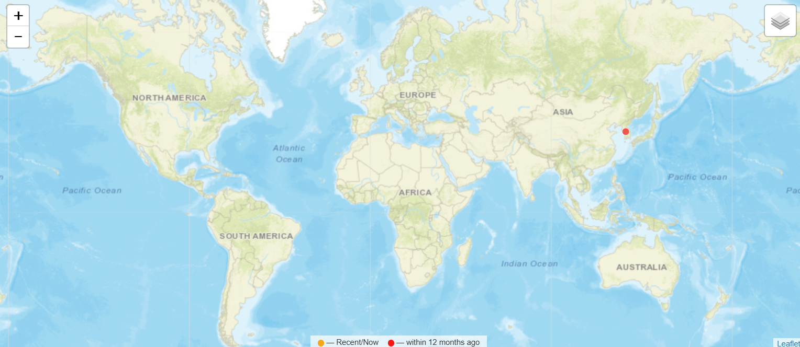</a></dl> -->

<!--  -->

<!-- 
# Miscellaneous

  
<strong>Talks and Shares</strong>

<dd><a href="https://www.bilibili.com/video/BV1gZ42177VL/?spm_id_from=333.337.search-card.all.click&vd_source=0b7a3cc3d3ec288abaca83b9a7e036af"><strong>泛化图学习与本科生科研经历分享</strong></a></dd>

  
<strong>Undergraduate research resource and enrollment process</strong>

<dd><a href="https://zxeupbuzh9y.feishu.cn/docx/ZDEsdpZtPosRWOxcBnkcF8Hknkd"><strong>Link</strong></a></dd>

  
<strong>Poems that inspire me</strong>

  <dd><strong>白鹭立雪，愚者看鹭，聪者观雪，智者见白</strong> —— A white egret stands in the snow. The foolish see only the egret, the wise observe the snow, and the enlightened perceive the whiteness.</dd>
  <dd><strong>世界不黑也不白, 而是一道精致的灰</strong> —— The world is neither black nor white, but a delicate shade of gray. </dd>

 

Handwriting of my Chinese name:
<dl></dl>

 

 
-->