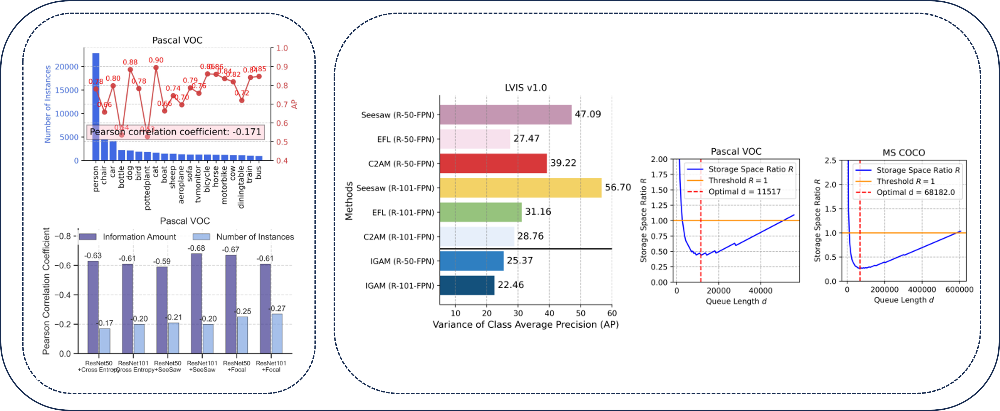








My name is Wei Dai (戴威), I'm a 3th-year undergraduate student at the School of Communication Engineering, Xi'an University of Electronic Science and Technology, supervised by [Licheng Jiao](https://faculty.xidian.edu.cn/JLC/zh_CN/index.htm) [Google Scholar](https://scholar.google.com/citations?user=FZbrL2YAAAAJ&hl=en)、[Xinbo Gao](https://web.xidian.edu.cn/xbgao/) [Google Scholar](https://scholar.google.com/citations?hl=zh-CN&user=VZVTOOIAAAAJ)、[Xi Yang](https://web.xidian.edu.cn/yangx/) [Google Scholar](https://scholar.google.com/citations?hl=zh-CN&user=W5c-LSYAAAAJ). I also worked with PhD student at Luojiashan Laboratory, Wuhan University [Wenke Huang](https://wenkehuang.github.io/), PhD student at the School of Artificial Intelligence, Xi'an University of Electronic Science and Technology[Yanbiao Ma](https://scholar.google.com/citations?hl=zh-CN&user=j05wwXcAAAAJ).  

🌟 I am actively applying for a PhD in the fall of 2026 , and applying for a direct PhD at a university summer camp in 2025! 

<!-- 🌟 I'm currently actively seeking for Ph.D., Research Assistant, or internship positions related to Graph Learning. I'm also open to any possible discussions or collaborate opportunities. If you're interested in working with me, don't hesitate to drop me an email!  -->

<!-- My curriculum vitae (**CV**) can be downloaded [here](https://github.com/GuanchengWan/guanchengWan.github.io/raw/master/docs/GuanchengWan_cv.pdf).  -->

# 🔎 Research 
"Any data is distributed in manifold space, and we use manifolds to explain objective physical laws" 

I am passionate about using <u>geometric perspectives</u> to explain laws in the world of manifolds. Currently, my research interests mainly focus on the following aspects:

a) AI for Science:  
- Bioinformatics (*e.g.*, Genomics)

- Public Health (*e.g.*, Epidemiology)

- Physics (*e.g.*, Neural ODE)

b) Federated Learning

c) Prototype learning

d) Data augmentation

<!--
 

# 🔥 News

<ul>
  <li><em>2024.11:</em> 🎈I was honored with <strong>Lei Jun Excellence Scholarship</strong> ~ <strong>100k</strong> (The <strong><u>Highest</u></strong> Scholarship at Wuhan University, <strong><u>Top-4</u></strong> among All Undergraduates, Award Rate ~ <strong>0.01%</strong>)</li>
  <li><em>2024.11:</em> I serve as a reviewer for <strong>CVPR 2025</strong>.</li>
  <li><em>2024.09:</em> ✨✨✨ Two papers were accepted by <strong>NeurIPS 2024</strong>. See you in Vancouver.</li>
  <li><em>2024.08:</em> Organize a tutorial at <strong>KDD 2024</strong> in Barcelona on 25th, come if you are interested in epidemics + GNN!</li>
  <li><em>2024.08:</em> I serve as a reviewer for <strong>ICLR 2025</strong>.</li>
  <li><em>2024.06:</em> ✨✨✨ One paper is accepted by <strong>TPAMI</strong>, congrats to all collaborators!</li>
  <li><em>2024.05:</em> I serve as a reviewer for <strong>NeurIPS 2024</strong>.</li>
  <li><em>2024.05:</em> ✨✨✨ Our survey about GNNs in Epidemic Modeling is accepted by <strong>KDD 2024</strong>. See you in Barcelona!</li>
  <li><em>2024.05:</em> ✨✨✨ One paper about self-supervised graph learning was accepted by <strong>ICML 2024</strong>. See you in Austria!</li>
  <li><em>2024.04:</em> 🚀🚀🚀 Explore our pre-print: a deep look at using Graph Neural Networks in Epidemic Modeling. Check our collected <a href="https://github.com/Emory-Melody/awesome-epidemic-modeling-papers">paper list</a>.</li>
  <li><em>2024.02:</em> I serve as a reviewer for <strong>ACM MM 2024</strong>.</li>
  <li><em>2024.02:</em> I serve as a reviewer for <strong>ECCV 2024</strong>.</li>
  <li><em>2023.12:</em> A paper was accepted to <strong>AAAI 2024</strong>. See you in Vancouver.</li>
  <li><em>2023.11:</em> I serve as a reviewer for <strong>CVPR 2024</strong>.</li>
  <li><em>2023.11:</em> 🚀🚀🚀 We thoroughly explore three core research areas in federated learning: generalization, robustness, and fairness. Don't hesitate to utilize our <a href="https://github.com/WenkeHuang/MarsFL">benchmarking codes</a> for your own research goal!</li>
  <li><em>2023.10:</em> I attended China National Computer Congress (CNCC) and was awarded the honor of CCF (China Computer Federation) Elite Collegiate Award (102 Students nation-wide).</li>
  <li><em>2023.10:</em> I won the National Scholarship for the second time (0.2% nation-wide), and was selected the Pacemaker to Merit Student (Award Rate: 60/59774=0.1%).</li>
  <li><em>2023.08:</em> We attended <em>The 32nd INTERNATIONAL JOINT CONFERENCE ON ARTIFICIAL INTELLIGENCE (<strong>IJCAI</strong>)</em> and presented our work in Macao.</li>
</ul>

 
-->

# 📃 Publications or Manuscripts

**&dagger; Equal Contribution**   

<dl>
  <dt>
</dt>
  <dd><strong>Geometric Knowledge-Guided Localized Global Distribution Alignment for Federated Learning</strong></dd>
<dd>Yanbiao Ma&dagger;, <strong><u>Wei Dai&dagger; </u></strong>(co-first), Wenke Huang, Jiayi Chen</dd>
<dd> Conference on Computer Vision and Pattern Recognition (<strong>CCF-A CVPR</strong>), 2025 </dd>
</dl>

<dl>
  <dt>
</dt>
  <dd><strong>Pursuing Better Decision Boundaries for Long-Tailed Object Detection via Category Information Amount</strong></dd>
<dd>Yanbiao Ma, <strong><u>Wei Dai</u></strong>, Jiayi Chen</dd>
<dd> International Conference on Learning Representations (<strong>Tsinghua-A ICLR</strong>), 2025</dd>
</dl>

<dl>
  <dt>
</dt>
  <dd><strong>Guideline for Novel Fine‐Grained Sentiment Annotation and Data Curation: A Case Study</strong></dd>
<dd><strong><u>Wei Dai</u></strong>, Wanqiu Kong, Tao Shang, Jianhong Feng, Jiaji Wu, Tan Qu</dd>
<dd> CCF-C SCI-Q2 IF-2.84 (<strong> journal 《Expert System》 </strong>), 2025</dd>
</dl>

# 📝 national invention patent

<dl>
  <dt>
</dt>
  <dd><a href="https://www.xjishu.com/zhuanli/55/202410893258.html"><strong>基于深度学习的多特征、模块化人工智能识别方法和系统</strong></a>
  <a href="https://xueshu.baidu.com/usercenter/paper/show?paperid=182y08t0251u0pu07k420t20en690534"><strong>[百度学术]</strong></a>
  <a href="https://github.com/WeiDai-David/Security-feature-detection-system"><strong>[Github]</strong></a></dd>
<dd><strong><u>Wei Dai</u></strong>, Jiayi Chen, Fengliang Mi</dd>
<dd>Under acceptance, 2024</dd>
</dl>

<dl>
  <dt>
</dt>
  <dd><a href="https://www.xjishu.com/zhuanli/55/202410893256.html"><strong>基于熵权法和统计偏差原则的多维角度评分系统及方法</strong></a>
  <a href="https://xueshu.baidu.com/usercenter/paper/show?paperid=1f190pa0cg3p08u06a6d0t00xv253723&site=xueshu_se"><strong>[百度学术]</strong></a></dd>
<dd>Jiayi Chen, <strong><u>Wei Dai</u></strong>, Fengliang Mi</dd>
<dd>Under acceptance, 2024</dd>
</dl>

<dl>
  <dt>
</dt>
  <dd><a href="https://xueshu.baidu.com/usercenter/paper/show?paperid=1n7y0xq0nf4k0eh0m754024005382777&site=xueshu_se"><strong>	一种基于LSTM的个性化心率异常监测方法 </strong></a>
  <a href="https://xueshu.baidu.com/usercenter/paper/show?paperid=1n7y0xq0nf4k0eh0m754024005382777&site=xueshu_se"><strong>[百度学术]</strong></a></dd>
<dd>Qiang Cui, <strong><u>Wei Dai</u></strong>, Jiayi Chen, Wenting Wei</dd>
<dd>Under acceptance, 2024</dd>
</dl>

#  🎖 Awards
 

<ul>
  <li><em>2024.11:</em> 🎈I was honored with <strong>Lei Jun Excellence Scholarship</strong> ~ <strong>100k</strong> (The <strong><u>Highest</u></strong> Scholarship at Wuhan University, <strong><u>Top-4</u></strong> among All Undergraduates, Award Rate ~ <strong>0.01%</strong>)</li>
  <li><em>2024.11:</em> I serve as a reviewer for <strong>CVPR 2025</strong>.</li>
  <li><em>2024.09:</em> ✨✨✨ Two papers were accepted by <strong>NeurIPS 2024</strong>. See you in Vancouver.</li>
  <li><em>2024.08:</em> Organize a tutorial at <strong>KDD 2024</strong> in Barcelona on 25th, come if you are interested in epidemics + GNN!</li>
  <li><em>2024.08:</em> I serve as a reviewer for <strong>ICLR 2025</strong>.</li>
  <li><em>2024.06:</em> ✨✨✨ One paper is accepted by <strong>TPAMI</strong>, congrats to all collaborators!</li>
  <li><em>2024.05:</em> I serve as a reviewer for <strong>NeurIPS 2024</strong>.</li>
  <li><em>2024.05:</em> ✨✨✨ Our survey about GNNs in Epidemic Modeling is accepted by <strong>KDD 2024</strong>. See you in Barcelona!</li>
  <li><em>2024.05:</em> ✨✨✨ One paper about self-supervised graph learning was accepted by <strong>ICML 2024</strong>. See you in Austria!</li>
  <li><em>2024.04:</em> 🚀🚀🚀 Explore our pre-print: a deep look at using Graph Neural Networks in Epidemic Modeling. Check our collected .</li>
  <li><em>2024.02:</em> I serve as a reviewer for <strong>ACM MM 2024</strong>.</li>
  <li><em>2024.02:</em> I serve as a reviewer for <strong>ECCV 2024</strong>.</li>
  <li><em>2023.12:</em> A paper was accepted to <strong>AAAI 2024</strong>. See you in Vancouver.</li>
  <li><em>2023.11:</em> I serve as a reviewer for <strong>CVPR 2024</strong>.</li>
</ul>

 

# 🎡 Service
## Conference Committee Member
- Reviewer for ICLR'2025
- Reviewer for CVPR'2025

# 📖 Educations
- *2022.09 - Now*, Undergraduate, School of Communication Engineering, Xi'an University of Electronic Science and Technology, China (GPA:3.9/4.0, Weighted Average scorc:91/100) 

<!-- 
<dl></dl>
-->

<!-- 
# Miscellaneous

  
<strong>Talks and Shares</strong>

<dd><a href="https://www.bilibili.com/video/BV1gZ42177VL/?spm_id_from=333.337.search-card.all.click&vd_source=0b7a3cc3d3ec288abaca83b9a7e036af"><strong>泛化图学习与本科生科研经历分享</strong></a></dd>

  
<strong>Undergraduate research resource and enrollment process</strong>

<dd><a href="https://zxeupbuzh9y.feishu.cn/docx/ZDEsdpZtPosRWOxcBnkcF8Hknkd"><strong>Link</strong></a></dd>

  
<strong>Poems that inspire me</strong>

  <dd><strong>白鹭立雪，愚者看鹭，聪者观雪，智者见白</strong> —— A white egret stands in the snow. The foolish see only the egret, the wise observe the snow, and the enlightened perceive the whiteness.</dd>
  <dd><strong>世界不黑也不白, 而是一道精致的灰</strong> —— The world is neither black nor white, but a delicate shade of gray. </dd>

 

Handwriting of my Chinese name:
<dl></dl>

 

 
-->