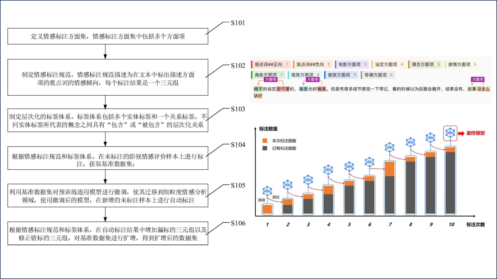








My name is Wei Dai (戴威), I'm a 4th-year undergraduate student at the School of Communication Engineering, Xidian University, supervised by [Yanbiao Ma](https://scholar.google.com/citations?hl=zh-CN&user=j05wwXcAAAAJ&view_op=list_works&sortby=pubdate). Meanwhile, I'm a 4th-year undergraduate student at the School of Electronic Engineering, Heriot-Watt University, supervised by [João Mota](https://scholar.google.com/citations?user=lFjaYrAAAAAJ&hl=zh-CN&oi=sra). Furthermore, I am a direct PhD student of the 2026 cohort at Tsinghua University,supervised by [Shao-lun Huang](https://scholar.google.com/citations?user=C3veL0IAAAAJ&hl=zh-CN&oi=ao).

<!-- 🌟 I am actively applying for a PhD in the fall of 2026 , and applying for a Direct PhD at a university summer camp in 2025!  -->

<!-- 🌟 I'm currently actively seeking for Research Assistant, or internship positions related to deep Learning. I'm also open to any possible discussions or collaborate opportunities. If you're interested in working with me, don't hesitate to drop me an email! -->

🌟 Newest update: 

(1) I am currently interning at Tsinghua TBSI, focusing on efficient transfer learning(4LLM). I look forward to sharing new research findings soon.

(2) I am completing my graduation project for Federated Graph Learning under the guidance of João Mota, who is a patient and nice teacher.

(3) Plan some interesting entrepreneurial projects with some passionate partners (4MultiAgent).

# 🔎 Research 
"The laws of the physical world serve as the fundamental driving force behind the advancement of artificial intelligence" 

I am passionate about using <u>physical Laws</u> to explain principle in the world. Currently, my research interests mainly focus on the following aspects:

a) Multimodal Large Model

b) Transfer Learning 

c) Trustworthy Machine Learning

 

# 🔥 News

<ul>
  <li><em>2026.2:</em> 🚀 One paper is accepted by TPAMI.</li>
  <li><em>2026.2:</em> 🚀 One paper is accepted by ICLR.</li>
  <li><em>2025.12:</em> ✨ I serve as a reviewer for ICLR 2026.</li>
  <li><em>2025.3:</em> 🚀 One paper is accepted by AAAI. See you in Singapore.</li>
  <li><em>2025.3:</em> 🌐 2025CVPR_GGEUR Code is publicly available! Office-Home-LDS Dataset is publicly available!</li>
  <li><em>2025.3:</em> 🚀 One paper is accepted by CVPR(5/5/5/4) Oral. See you in Tennessee.</li>
  <!-- <li><em>2025.2:</em> ✨ I serve as a reviewer for 《IEEE Access》.</li> -->
  <li><em>2025.2:</em> 🚀 One paper is accepted by ICLR. See you in Singapore.</li>
  <!-- <li><em>2025.1:</em> 🚀 One paper is accepted by journal《Entropy》.</li> -->
  <li><em>2024.12:</em> ✨ I serve as a reviewer for CVPR 2025.</li>
  <!-- <li><em>2024.12:</em> 🚀 One paper is accepted by journal《Expert Systems》.</li> -->
  <li><em>2024.10:</em> 🎈 I was honored with a scholarship from Xidian University.</li>
</ul>

 

# 📃 Publications

**&dagger; Equal Contribution**   

<dl>
  <dt>
</dt>
  <dd><a href="https://arxiv.org/pdf/2503.06457"><strong>Geometric Knowledge-Guided Localized Global Distribution Alignment for Federated Learning</strong></a>
  <a href="https://github.com/WeiDai-David/2025CVPR_GGEUR"><strong>[Github]</strong></a>
  <a href="https://huggingface.co/datasets/WeiDai-David/Office-Home-LDS"><strong>[Dataset]</strong></a></dd>
<dd>Yanbiao Ma&dagger;, <strong><u>Wei Dai&dagger; </u></strong>(co-first), Wenke Huang, Jiayi Chen</dd>
<dd> Conference on Computer Vision and Pattern Recognition (<strong>CCF-A CVPR</strong>), <strong class="co-first"><i>Oral Presentation (Top 0.5%)</i></strong>, 2025 </dd>
</dl>

<dl>
  <dt>
</dt>
  <dd><a href="https://arxiv.org/pdf/2508.13518"><strong>Calibrating Biased Distribution in VFM-derived Latent Space via Cross-Domain Geometric Consistency</strong></a>
  <a href="https://github.com/WeiDai-David/2025CVPR_GGEUR"><strong>[Github]</strong></a>
<dd>Yanbiao Ma;, <strong><u>Wei Dai; </u></strong>, Bowei Liu, Jiayi Chen, Wenke Huang, Guancheng Wan, Zhiwu Lu, Junchi Yan</dd>
<dd>IEEE Transactions on Pattern Analysis and Machine Intelligence (<strong>CCF-A TPAMI</strong>), 2026 </dd>
</dl>

<dl>
  <dt>
</dt>
  <dd><a href="https://openreview.net/forum?id=LW55JrLYPg"><strong>Pursuing Better Decision Boundaries for Long-Tailed Object Detection via Category Information Amount</strong></a></dd>
<dd>Yanbiao Ma, <strong><u>Wei Dai</u></strong>, Jiayi Chen</dd>
<dd> International Conference on Learning Representations (<strong>Tsinghua-A ICLR</strong>), 2025</dd>
</dl>

<dl>
  <dt>
</dt>
  <dd><a href="https://arxiv.org/pdf/2506.14418"><strong>Compositional Attribute Imbalance in Vision Datasets</strong></a></dd>
<dd>Yanbiao Ma&dagger;, Jiayi Chen&dagger;, <strong><u>Wei Dai</u></strong>, Dong Zhao, Zeyu Zhang, Yuting Yang, Bowei Liu, Jiaxuan Zhao, Andi Zhang</dd>
<dd> AAAI Conference on Artificial Intelligence (<strong>CCF-A AAAI</strong>), 2025</dd>
</dl>

<!-- <dl>
  <dt>
</dt>
  <dd><a href="https://onlinelibrary.wiley.com/doi/10.1111/exsy.70022"><strong>Guideline for Novel Fine‐Grained Sentiment Annotation and Data Curation: A Case Study</strong></a></dd>
<dd><strong><u>Wei Dai</u></strong>, Wanqiu Kong, Tao Shang, Jianhong Feng, Jiaji Wu, Tan Qu</dd>
<dd> CCF-C JCR-Q1 IF-3 <strong>  journal 《Expert System》 </strong>, 2025</dd>
</dl>

 -->
<!-- 
<dl>
  <dt>
</dt>
  <dd><a href="https://www.mdpi.com/1099-4300/27/2/201"><strong>Trade-Offs Between Richness and Bias of Augmented Data in Long-Tailed Recognition</strong></a></dd>
<dd><strong><u>Wei Dai</u></strong>, Yanbiao Ma, Jiayi Chen, Xiaohua Chen, Shuo Li</dd>
<dd> CAS-Q3 JCR-Q2 IF-2.2 <strong>  journal 《Entropy》 </strong>, 2025</dd>
</dl>

<dl>
  <dt>
</dt>
  <dd><a href="https://ieeexplore.ieee.org/document/10938612"><strong>Exploring Beyond Logits: Hierarchical Dynamic Labeling Based on Embeddings for Semi-Supervised Classification</strong></a></dd>
<dd>Jiayi Chen, Yanbiao Ma, <strong><u>Wei Dai</u></strong>, Xiaohua Chen, Shuo Li</dd>
<dd> CAS-Q4 JCR-Q2 IF-3.4 <strong>  journal 《IEEE Access》 </strong>, 2025</dd>
</dl> -->

<!-- 

<dl>
  <dt>
</dt>
  <dd><a href="https://arxiv.org/pdf/2502.11809"><strong>Revealing Bias Formation in Deep Neural Networks Through the
 Geometric Mechanisms of Human Visual Decoupling</strong></a></dd>
<dd>Yanbiao Ma, Bowei Liu, <strong><u>Wei Dai</u></strong>, Jiayi Chen, Shuo Li</dd>
<dd> Under review, 2025</dd>
</dl> -->

<!-- 

# 📝 National invention patent

<dl>
  <dt>
</dt>
  <dd><a href="https://www.xjishu.com/zhuanli/55/202410893258.html"><strong>Multi feature, modular artificial intelligence recognition method and system based on deep learning</strong></a>
  <a href="https://xueshu.baidu.com/usercenter/paper/show?paperid=182y08t0251u0pu07k420t20en690534"><strong>[Baidu Scholar]</strong></a>
  <a href="https://github.com/WeiDai-David/Security-feature-detection-system"><strong>[Github]</strong></a></dd>
<dd><strong><u>Wei Dai</u></strong>, Jiayi Chen, Fengliang Mi</dd>
<dd>Under acceptance, 2024</dd>
</dl>

<dl>
  <dt>
</dt>
  <dd><a href="https://www.xjishu.com/zhuanli/55/202410893256.html"><strong>Multidimensional scoring system and method based on entropy weight method and statistical bias principle</strong></a>
  <a href="https://xueshu.baidu.com/usercenter/paper/show?paperid=1f190pa0cg3p08u06a6d0t00xv253723&site=xueshu_se"><strong>[Baidu Scholar]</strong></a></dd>
<dd>Jiayi Chen, <strong><u>Wei Dai</u></strong>, Fengliang Mi</dd>
<dd>Under acceptance, 2024</dd>
</dl>

<dl>
  <dt>
</dt>
  <dd><a href="https://xueshu.baidu.com/usercenter/paper/show?paperid=1n7y0xq0nf4k0eh0m754024005382777&site=xueshu_se"><strong>A personalized heart rate anomaly monitoring method based on LSTM</strong></a>
  <a href="https://xueshu.baidu.com/usercenter/paper/show?paperid=1n7y0xq0nf4k0eh0m754024005382777&site=xueshu_se"><strong>[Baidu Scholar]</strong></a></dd>
<dd>Qiang Cui, <strong><u>Wei Dai</u></strong>, Jiayi Chen, Wenting Wei</dd>
<dd>Under acceptance, 2024</dd>
</dl>

<dl>
  <dt>
</dt>
  <dd><a href="https://xueshu.baidu.com/usercenter/paper/show?paperid=18520tm03g600gs06p2w0c7081358990"><strong>A method and device for constructing a fine-grained sentiment analysis dataset</strong></a>
  <a href="https://xueshu.baidu.com/usercenter/paper/show?paperid=18520tm03g600gs06p2w0c7081358990"><strong>[Baidu Scholar]</strong></a></dd>
<dd>Wanqiu Kong, Shangnan Zhou, <strong><u>Wei Dai</u></strong>, Yiwen Li</dd>
<dd>Under acceptance, 2024</dd>
</dl> -->

<!-- 

 -->

# 🎖 Awards

<ul>
<!--   <li><em></em> ✨✨✨ <strong>National level</strong> Leader of "Intelligent Sports Vision - Sports Training Feedback System Based on Deep Learning"</li>
  <li><em></em> ✨✨✨ <strong>National level</strong> Core member of "Unmanned Safety Operation Monitoring, Binding, and Emergency Command System"</li>
  <li><em></em> ✨✨✨ College Student Computer Innovation Competition <strong>National level</strong> third prize.</li>
  <li><em></em> ✨✨✨ mathematical contest in modeling <strong>provincial level</strong> second prize.</li> -->
  <li><em></em> ✨✨✨ Academician Duan Baoyan's Science and Education Innovation Award.</li>
  <li><em></em> ✨✨✨ Xidian University  scholarship.</li>
</ul>

<!-- 

 -->

# 🎡 Service
## Conference Committee Member
- Reviewer for ICLR'2026
- Reviewer for CVPR'2025
<!-- ## Journal Reviewer
- Reviewer for IEEE Access -->

# 📖 Educations
- *2022.09 - Now*, Undergraduate, School of Communication Engineering, Xi'an University of Electronic Science and Technology, China (GPA:3.9/4.0, Weighted Average scorc:91/100) 

<!-- <dl></dl> -->
<!-- <dl></dl> -->

<!--  -->

<!-- 
# Miscellaneous

  
<strong>Talks and Shares</strong>

<dd><a href="https://www.bilibili.com/video/BV1gZ42177VL/?spm_id_from=333.337.search-card.all.click&vd_source=0b7a3cc3d3ec288abaca83b9a7e036af"><strong>泛化图学习与本科生科研经历分享</strong></a></dd>

  
<strong>Undergraduate research resource and enrollment process</strong>

<dd><a href="https://zxeupbuzh9y.feishu.cn/docx/ZDEsdpZtPosRWOxcBnkcF8Hknkd"><strong>Link</strong></a></dd>

  
<strong>Poems that inspire me</strong>

  <dd><strong>白鹭立雪，愚者看鹭，聪者观雪，智者见白</strong> —— A white egret stands in the snow. The foolish see only the egret, the wise observe the snow, and the enlightened perceive the whiteness.</dd>
  <dd><strong>世界不黑也不白, 而是一道精致的灰</strong> —— The world is neither black nor white, but a delicate shade of gray. </dd>

 

Handwriting of my Chinese name:
<dl></dl>

 

 
-->